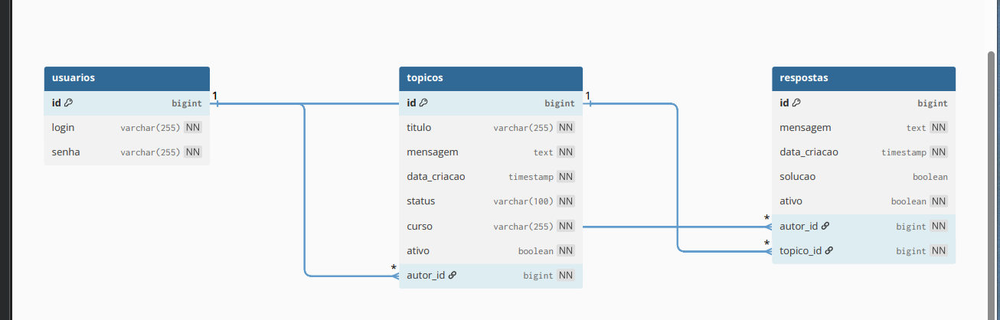

# Fórum Hub - API REST v2.0

  
  
  

## 📖 Descrição do Projeto

API REST para um fórum de discussões, desenvolvida como o desafio final do programa ONE (Oracle Next Education) em parceria com a Alura. A aplicação simula o back-end de um fórum, permitindo o gerenciamento completo de tópicos e respostas, com um sistema de autenticação e autorização seguro baseado em Tokens JWT.

## ✨ Funcionalidades

A API do Fórum Hub é dividida em módulos, com endpoints para autenticação, gerenciamento de tópicos e de respostas.

### 🔐 Segurança e Autenticação
A API utiliza Spring Security com autenticação stateless via Tokens JWT. Para acessar os endpoints protegidos, é necessário primeiro obter um token.

* **`POST /login`**: Autentica um usuário com `login` e `senha` e retorna um token JWT de acesso.

### 🔐 Segurança e Autenticação
* **`POST /usuarios`**: Cadastra um novo usuário na plataforma. (Público)
* **`POST /login`**: Autentica um usuário com `login` e `senha` e retorna um token JWT de acesso. (Público)

### 📝 Tópicos
* **`POST /topicos`**: Cadastra um novo tópico no banco de dados. (Requer autenticação)
* **`GET /topicos`**: Lista todos os tópicos ativos, com paginação e ordenação. (Requer autenticação)
* **`GET /topicos/{id}`**: Exibe os detalhes de um tópico específico. (Requer autenticação)
* **`PUT /topicos/{id}`**: Atualiza os dados de um tópico existente. (Requer autenticação)
* **`DELETE /topicos/{id}`**: Realiza a exclusão lógica de um tópico. (Requer autenticação)

### 💬 Respostas
* **`POST /respostas`**: Cadastra uma nova resposta para um tópico. (Requer autenticação)
* **`GET /topicos/{id}/respostas`**: Lista todas as respostas ativas de um tópico específico. (Requer autenticação)
* **`PUT /respostas/{id}`**: Atualiza o conteúdo de uma resposta. (Apenas o autor original pode atualizar)
* **`DELETE /respostas/{id}`**: Realiza a exclusão lógica de uma resposta. (Apenas o autor original pode excluir)

### 📜 Documentação
A API possui documentação interativa gerada automaticamente com Springdoc (Swagger).

* **`GET /swagger-ui.html`**: Acessa a interface do Swagger para visualizar e testar todos os endpoints da API.

## 💼 Regras de Negócio
- **Autenticação Obrigatória:** Todos os endpoints, exceto `/login` e a documentação do Swagger, exigem um token JWT válido no cabeçalho de autorização.
- **Autorização:** Apenas o autor original de uma resposta pode alterá-la ou excluí-la.
- **Validação de Campos:** Os campos para cadastro e atualização são validados para não serem nulos ou vazios.
- **Prevenção de Duplicatas:** A API impede o cadastro ou a atualização de um tópico que resulte em título e mensagem idênticos a um já existente.
- **Tratamento de Erros:** A API retorna códigos de status HTTP apropriados para cada situação (ex: `404 Not Found`, `403 Forbidden`).

## 📊 Diagrama do Banco de Dados

## 🛠️ Tecnologias Utilizadas

-   **Java 17**
-   **Spring Boot 3**
-   **Spring Web**
-   **Spring Data JPA**
-   **Spring Security**
-   **Spring Boot Validation**
-   **Maven** (Gerenciador de Dependências)
-   **Lombok** (Redução de código boilerplate)
-   **H2 Database** (Banco de dados em memória para desenvolvimento)
-   **JWT (Java JWT)** para geração e validação de tokens
-   **Springdoc (Swagger)** para documentação da API

---

Feito com muito aprendizado por **Michele Lescano** 👋

---
## 👩‍💻 Autora

**Michele Lescano**

